# 📖 Resolução do Desafio Técnico - Estágio em Análise de dados | Sefaz Maceió 
## 📍 Introdução

O presente arquivo serve para salvar minhas conclusões, análises, metodologia e eventuais necessários para o desafio proposto, informado no [INSTRUCOES](./INSTRUCOES.md).

Texto do desafio: "Seu objetivo final é **comparar como as capitais gastam o dinheiro público por área (função)**, olhando principalmente para a diferença entre o que foi **empenhado** (reservado/comprometido) e o que foi efetivamente **pago**."
Além do objetivo proposto no texto, acima, o desafio conta com sugestões para que outras análises possam ser feitas. Algumas das sugestões foram aceitas.

> Pastas e arquivos como "dados_extraidos/", "dados_processados/", "dados_otimizados/" e ".parquet" não foram versionados nesse repositório. Como presente pelas linhas descomentadas no gitignore.

## 📋 Metodologia

### Tecnologias:
Para esse projeto, foram utilizados:
* Ambiente Virtual (venv) em Python v3.13.5
* Arquivos Python (`.py`) e Jupyter Notebooks (`.ipynb`)
* As devidas extênsões do VScode para que ambos funcionassem corretamente.

### Estrutura de resolução:
> Seguindo as demandas passo a passo do desafio.

* Foram criados scritps (pasta `scritps/`) Python para fazer as etapas de Descompactação, Consolidação em um único banco de dados e Otimização do banco de dados. Cada função foi separa num arquivo próprio, utilizando algumas das ferramentas (Pathlib, por exemplo) sugeridas no [INSTRUCOES](./INSTRUCOES.md). 
* Os Jupyter Notebooks foram organizados na pasta `notebooks/`, fazendo cada um uma análise diferente, tanto do que foi pedido, quanto de análises sugeridas. Para esse caso, a análise de "verificar a evolução de uma função ao longo dos anos entre Maceió/AL e a média das capitais" foi realizada, presente mais adiante neste arquivo.
* A pasta `imagens/` foi criada para guardar as imagens dos gráficos gerados nas análises.
* O arquivo `main.py` foi criado para facilitar a geração da base de dados utilizada nas análises finais por eventuais interessados.

### Porque foi utilizado o formato Parquet?
    Para essa resolução, o formato Parquet foi o adotado pela sua compactação dos dados, permitindo um armazenamento melhor. Tal formato é amplamente usado para facilitar o armazenamento de conjuntos de dados afim de economizar armazenamento e tempo de leitura, visto que ele organiza os arquivos em colunas ao invés de linhas, oque também permite queries analíticas melhores.

## ⚙️ Como executar?

### Prepara o ambiente e dependências
Certifique-se de que seu ambiente virtual (venv) está instalado e configurado, após isso, use o comando `pip install -r requirements.txt`. 

### Executar o Pipeline de Dados: Via Terminal
Antes de abrir qualquer Notebook, rode o orquestrador principal na raiz do projeto:
`python main.py`
Isso executará a sequência automática de descompactação, consolidação e otimização dos dados, gerando a base limpa em formato `.parquet`.

### Configurar o Interpretador nos Notebooks: Aviso Importante
Ao abrir os arquivos Jupyter Notebook `(.ipynb)`, certifique-se de selecionar o Kernel/Interpretador correto (o mesmo da sua venv). Se você utilizar o interpretador global do sistema, o código falhará por falta das bibliotecas instaladas.

### Execução Cronológica das Células: Executando Corretamente
Dentro dos Notebooks, as células dependem da memória uma das outras. Execute as células estritamente na ordem numérica (1, 2, 3...). Tentar pular direto para as células de gráficos sem rodar os filtros anteriores causará erros de índice `(KeyError)`.

## 📊 Análises

O gráfico usado para encontrar diferenças acentuadas entre oque foi Empenhado e Pago para as funções foi um mapa de calor. Enquanto o utilizado nos demais casos (para subfunções, a comparação entre Maceió e a Média das capitais) foram gráficos de barras (horizontais e verticais).

> Importante informar que, nas análises sobre a diferença entre Empenhado x Pago com funções e subfunções, 
> foi criada uma coluna chamada "Empenhado x Pago" para evidenciar essa diferença.

### Respondendo a pergunta principal:
*Seu objetivo final é **comparar como as capitais gastam o dinheiro público por área (função)**,
olhando principalmente para a diferença entre o que foi **empenhado** (reservado/comprometido)
e o que foi efetivamente **pago**.*

Segundo oque os gráficos expressam (em suma, de 2020 a 2024), São Paulo (SP) foi muito constante quanto a diferenças entre o Empenhado e o Pago, principalmente nos setores de Educação e Urbanismo, outros setores
como Saúde, e posteriomente Sanemaneto também aparecem. Ao longo dos anos Educação parou de ter essa diferença enquanto Urbanismo a apresentou mais. 
Rio de Janeiro (RJ) também chegou a aparecer um pouco em 2020 com Educação, Saúde e Previdência Social, tendo uma melhora nos anos de 2021-2022, mas voltando a aparecer mais em 2024, com as mesmas áreas.
Belo Horizonte (MG) vem mostrando um problema crescente em sua Saúde desde 2023.

Algumas dessas áreas ficaram muito mais evidentes até pelo fator de serem muito habitadas, São Paulo é a maior metrópole da América Latina e Rio de Janeiro sempre foi uma área que apareceu muito, então é de se pensar que esses problemas mais gritantes surgiriam nessas áreas mais famosas e populosas.

O ano de 2025 possui dados incompletos, então dificilmente pode ser utilizado em todos os casos, porém, oque ele evidencia é: 
- Rio de Janeiro teve uma piora signicativa na sua Educação, Previdência social e Urbanismo, além de ainda apresentar uma relação ruim em Saúde;
- Belo Horizonte piorou signicativamente na diferença entre o que foi empenhado e pago com Saúde e Educação; 
- São Luís (MA) teve uma diferença grande em Educação

**A Educação aparece com diferenças constantes em grandes capitais.**

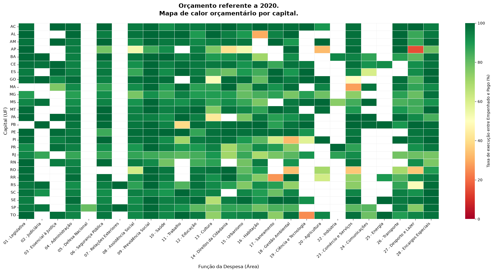
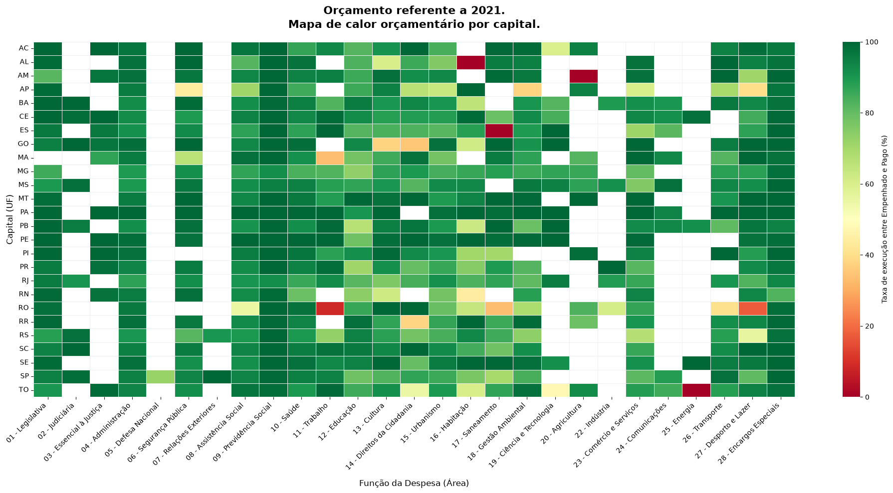
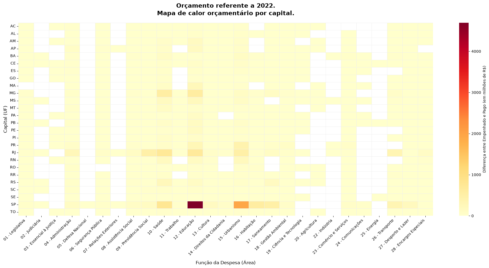
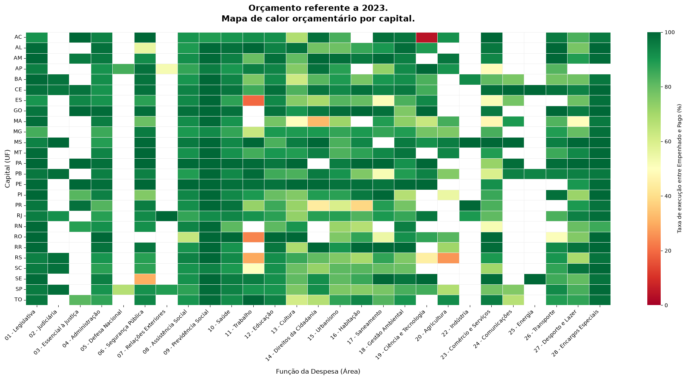
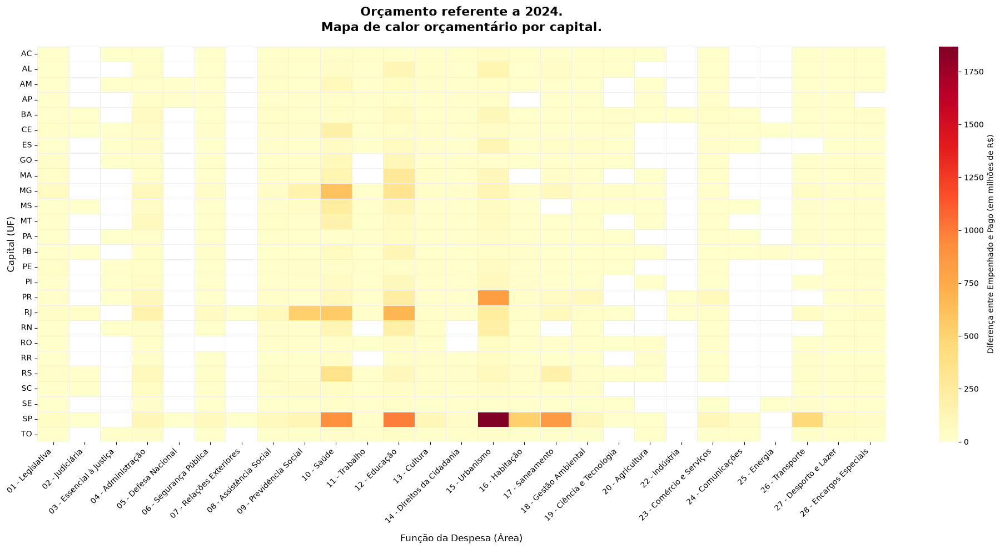
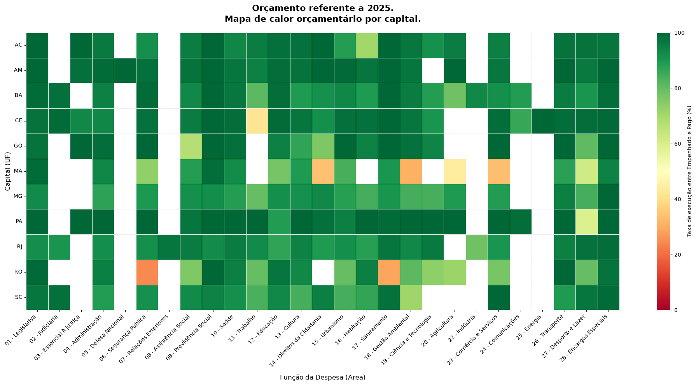

Um pequeno parágrafo sobre o panorama geral das capitais, seus valores entre o empenhado e pago calculados nos anos de 2020 a 2024, nele é mostrado que São Paulo, até por ser uma populosa capital possui a maior diferença, seguido por menos da metade por Rio de Janeiro e Belo Horizonte. 
Também vemos capitais menores como Aracaju(SE), Rio Branco (AC) e Palmas (TO) tendo as menores diferenças totais.
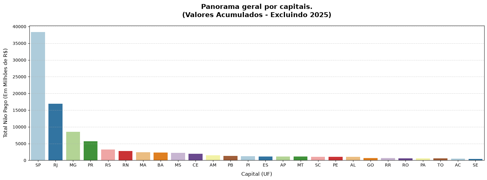

### Agora sobre as Subfunções:
Uma sugestão presente no README era fazermos também análises com as subfunções. Segundo análises do DataFrame final, haviam 147 subfunções únicas, o que poderia resultar na necessidades de análises menores e até com grandes gráficos. 
Por isso, foi tomada uma abordagem diferente.

A estratégia de uma coluna "Empenhado x Pago" foi mantida, mas os gráficos mostram apenas a área com a maior diferença no ano em questão, isolando o pior caso dentre as subfunções.

#### De 2020 a 2024:
* É perceptível que Rio de Janeiro(RJ) e São Paulo (SP) ainda aparecem nas maiores colocações. Com São Paulo repetindo Educação Infantil em 2021/2022 mas depois apresentando mais subfunções de Serviços e Infraestrutura urbanos. Já Rio de Janeiro apresenta desafios constantes com seu Ensino Fundamental desde 2021.
* Belo Horizonte (MG), apesar de uma variação no ranking em 2024, sempre apresentou um desafio com Assistência Hospitalar e Ambulatorial.

#### Sobre 2025 apenas:
* Rio de Janeiro aparecem com problemas em sua Educação Básica, semelhante, mas ainda diferente de 2024; e Belo Horizonte aparece com a mesma área dos anos seguintes, já demostrando algo comum.

**Pode-se perceber que uma ligação com as funções, as capitais apresentam desafios constantes sobre sua educação, tanto em função geral quanto nas subfunções (níveis de escolaridade).**

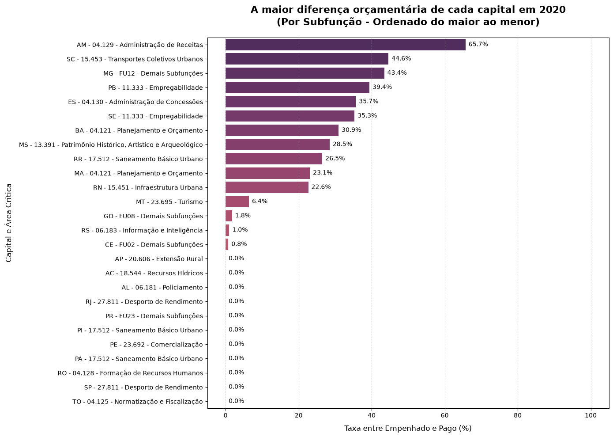
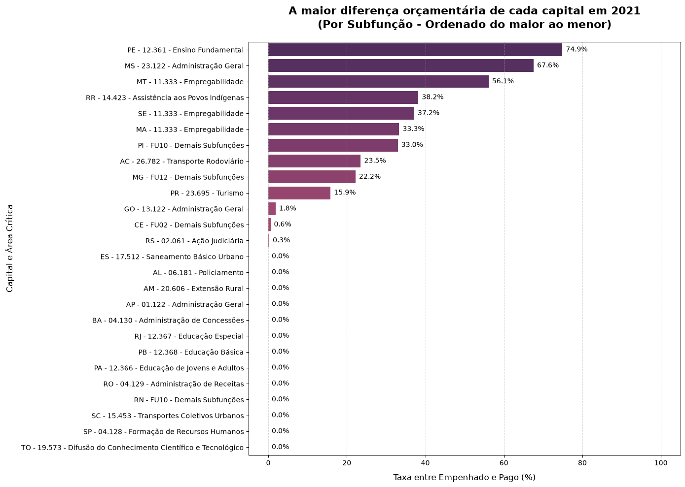
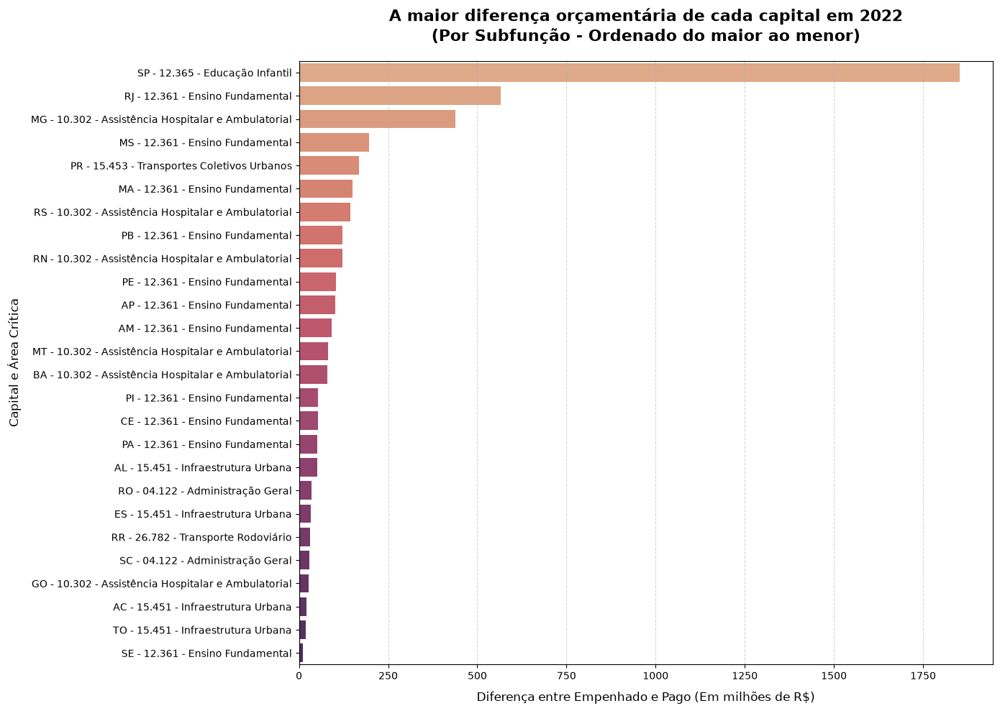
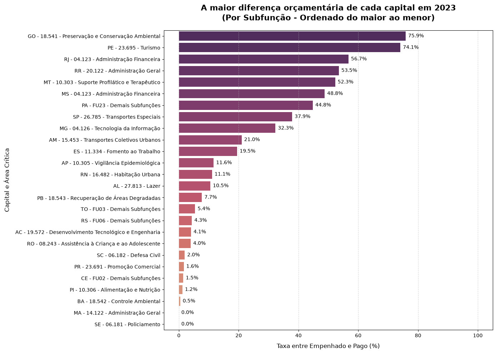
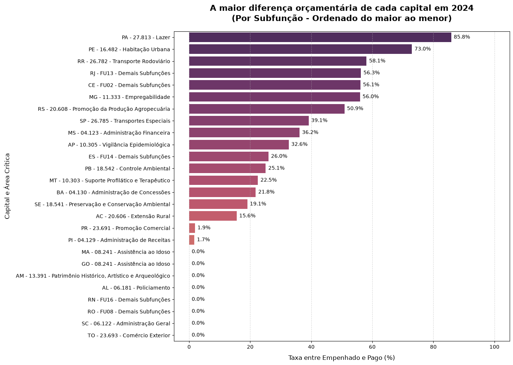
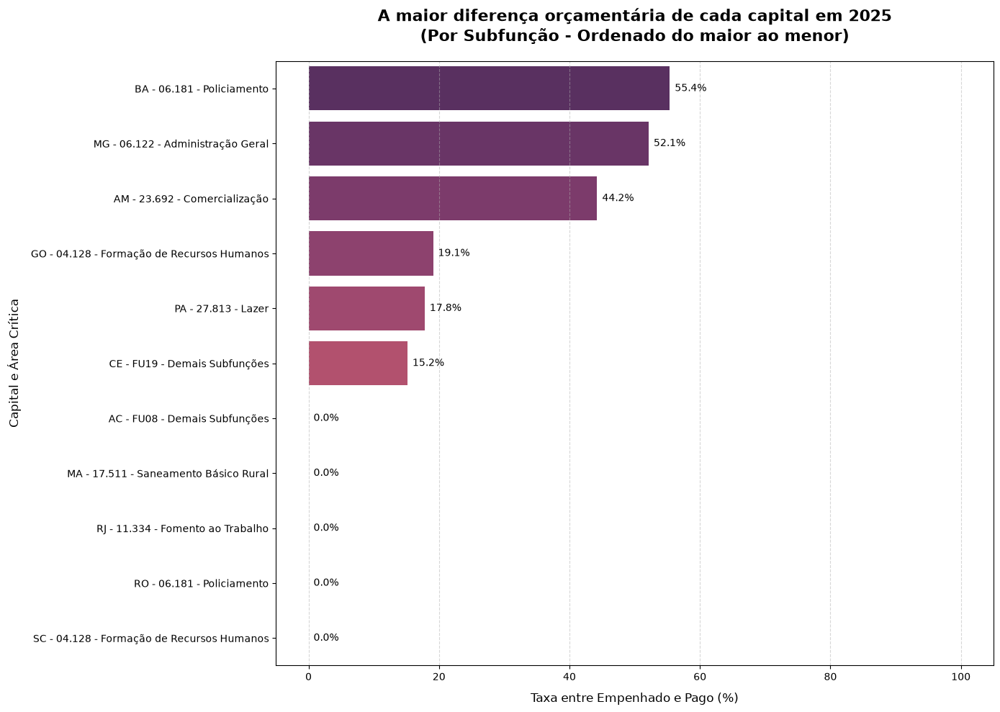

### Maceió x Média das Capitais.
Nesta parte uma sugestão de análise do [INSTRUCOES](./INSTRUCOES.md) foi desenvolvida:
_- Veja a **evolução ao longo dos anos** (2020 a 2024) de uma função para Maceió e compare com a média das capitais._

Aqui foi escolhida a função 23 - Comércio e Serviços, por representar a área do turismo, algo importante na região de Maceió.

Avaliando o gráfico, percebe-se que Maceió teve uma crescente na diferença entre oque foi empenhado e oque foi pago, mas nunca tanto quanto a média, porém, sobre esta, algo deve ser visto com atenção, considerando que a média junta tanto capitais pequenas quanto as grandes como São Paulo e Rio de Janeiro, isso pode gerar uma média elevada pelas grandes capitais.

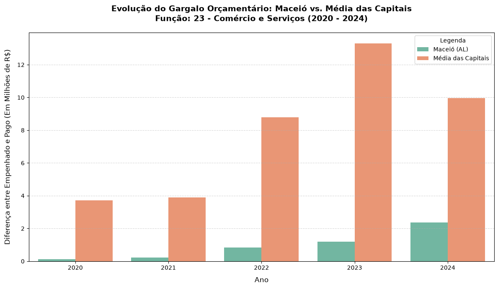

## 🎯 Conclusões
O projeto em geral foi muito enquirecedor, pude unir tanto conhecimentos que já havia visto/utilizado, como Python, pandas e boas práticas Git/GitHub, quanto ter a oportunidade de utilizar dados reais, cujas análises e decisões são importantíssimas, ainda por cima, aprender algo novo, nunca havia utilizado Pathlib, o formato .`parquet` ou mesmo dados de algo governamental.

Sem dúvidas um projeto que me trouxe frutos, tenho o prazer de compartilhá-lo e aprender com os feedbacks dele.

## 📫 Contato
[LinkedIn](https://www.linkedin.com/in/edvaldo-neto-dados/)
