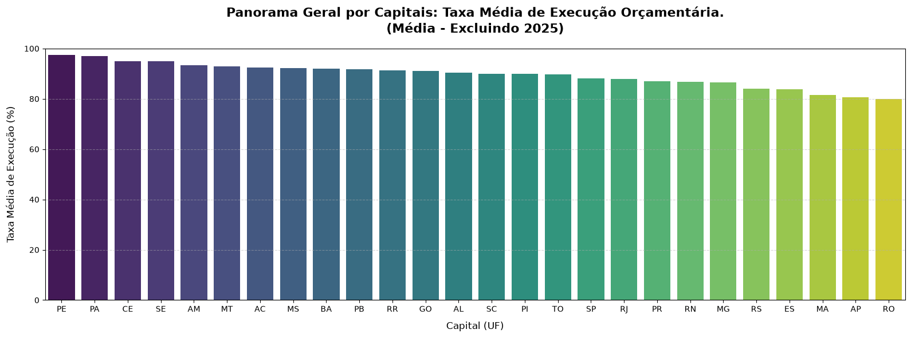

# 📖 Resolução do Desafio Técnico - Estágio em Análise de dados | Sefaz Maceió 
## 📍 Introdução

O presente arquivo serve para salvar minhas conclusões, análises, metodologia e eventuais necessários para o desafio proposto, informado no [INSTRUCOES](./INSTRUCOES.md).

Texto do desafio: "Seu objetivo final é **comparar como as capitais gastam o dinheiro público por área (função)**, olhando principalmente para a diferença entre o que foi **empenhado** (reservado/comprometido) e o que foi efetivamente **pago**."
Além do objetivo proposto no texto, acima, o desafio conta com sugestões para que outras análises possam ser feitas. Algumas das sugestões foram aceitas.

> Pastas e arquivos como "dados_extraidos/", "dados_processados/", "dados_otimizados/" e ".parquet" não foram versionados nesse repositório. Como presente pelas linhas descomentadas no gitignore.

## 📋 Metodologia

### Tecnologias:
Para esse projeto, foram utilizados:
* Ambiente Virtual (venv) em Python v3.13.5
* Arquivos Python (`.py`) e Jupyter Notebooks (`.ipynb`)
* As devidas extênsões do VScode para que ambos funcionassem corretamente.

### Estrutura de resolução:
> Seguindo as demandas passo a passo do desafio.

* Foram criados scritps (pasta `scritps/`) Python para fazer as etapas de Descompactação, Consolidação em um único banco de dados e Otimização do banco de dados. Cada função foi separa num arquivo próprio, utilizando algumas das ferramentas (Pathlib, por exemplo) sugeridas no [INSTRUCOES](./INSTRUCOES.md). 
* Os Jupyter Notebooks foram organizados na pasta `notebooks/`, fazendo cada um uma análise diferente, tanto do que foi pedido, quanto de análises sugeridas. Para esse caso, a análise de "verificar a evolução de uma função ao longo dos anos entre Maceió/AL e a média das capitais" foi realizada, presente mais adiante neste arquivo.
* A pasta `imagens/` foi criada para guardar as imagens dos gráficos gerados nas análises.
* O arquivo `main.py` foi criado para facilitar a geração da base de dados utilizada nas análises finais por eventuais interessados.

### Porque foi utilizado o formato Parquet?
Para essa resolução, o formato Parquet foi o adotado pela sua compactação dos dados, permitindo um armazenamento melhor. Tal formato é amplamente usado para facilitar o armazenamento de conjuntos de dados afim de economizar armazenamento e tempo de leitura, visto que ele organiza os arquivos em colunas ao invés de linhas, oque também permite queries analíticas melhores.

## ⚙️ Como executar?

### Prepara o ambiente e dependências
Certifique-se de que seu ambiente virtual (venv) está instalado e configurado, após isso, use o comando `pip install -r requirements.txt`. 

### Executar o Pipeline de Dados: Via Terminal
Antes de abrir qualquer Notebook, rode o orquestrador principal na raiz do projeto:
`python main.py`
Isso executará a sequência automática de descompactação, consolidação e otimização dos dados, gerando a base limpa em formato `.parquet`.

### Configurar o Interpretador nos Notebooks: Aviso Importante
Ao abrir os arquivos Jupyter Notebook `(.ipynb)`, certifique-se de selecionar o Kernel/Interpretador correto (o mesmo da sua venv). Se você utilizar o interpretador global do sistema, o código falhará por falta das bibliotecas instaladas.

### Execução Cronológica das Células: Executando Corretamente
Dentro dos Notebooks, as células dependem da memória uma das outras. Execute as células estritamente na ordem numérica (1, 2, 3...). Tentar pular direto para as células de gráficos sem rodar os filtros anteriores causará erros de índice `(KeyError)`.

## 📊 Análises

O gráfico usado para encontrar diferenças acentuadas entre oque foi Empenhado e Pago para as funções foi um mapa de calor. Enquanto o utilizado nos demais casos (para subfunções, a comparação entre Maceió e a Média das capitais) foram gráficos de barras (horizontais e verticais).

> Importante informar que, nas análises sobre a diferença entre Empenhado x Pago com funções e subfunções, 
> foi criada uma coluna chamada "Empenhado x Pago" para evidenciar essa diferença.

### Respondendo a pergunta principal (Sobre Funções):
*Seu objetivo final é **comparar como as capitais gastam o dinheiro público por área (função)**,
olhando principalmente para a diferença entre o que foi **empenhado** (reservado/comprometido)
e o que foi efetivamente **pago**.*

Para isso, calculamos a Taxa de Execução (%), uma medida para ajudar a mensurar como estava essa diferença entre as capitais. A Taxa é calculada da seguinte forma:
> Taxa de Execução = (Pago / Empenhado) * 100

Quanto maior a taxa (0 - 100), menor foi a diferença entre oque foi empenhado e pago (sendo expresso como mais próximo ao Verde no mapa de calor), e quanto menor a taxa, maior a diferença (mais próxima ao Vermelho).

Segundo oque os gráficos expressam (em suma, de 2020 a 2024), a situação se manteve sem padrões muito presentes, o mais comum foi 20 - Agricultura no AM (Amazonas) por 2 anos consecutivos em 2021 e 2022. Outros pontos que valem ser ressaltados são:
No ano de 2020:
- Macapá (AP) em 27 - Desporto e Lazer foi o mais preocupante, porém não sendo algo tão absurdo;

No ano de 2021:
- Palmas (TO) em 25 - Energia;
- Porto Velho (RO) em 11 - Trabalho, sendo até o menor entre os demais do mesmo ano;
- Vitória (ES) em 17 - Saneamento;
- Manaus (AM) em 20 - Agricultura, como citado acima;
- Maceió (AL) em 16 - Habitação;

No ano de 2022:
- Vitória (ES) e Goiânia (GO) em 10 - Trabalho;
- São Luís (MA) em 19 - Ciência e Tecnologia;
- Manaus (AM) em 20 - Agricultura, novamente;
- Rio Branco (AC) em 16 - Habitação;

No ano de 2023:
- Rio Branco (AC) em 19 - Ciência e Tecnologia, sendo até um caso menor comparado a outros dos outros anos;

No ano de 2024:
- Florianópolis (SC) em 23 - Comércio e Serviços;
- São Luís (MA) em 24 - Comunicações;
- Goiânia (GO) em 10 - Trabalho;

Dentre esses 4 anos (2020 - 2024) pode-se ter a conclusão de que: 2020 foi um dos melhores anos, praticamente não havendo grandes casos. Ademais, a função de 11 - Trabalho, parece ser a mais complicada desde 2022 pelas capitais.

E por último, sobre o ano de 2025, como foi informado no [INSTRUCOES](./INSTRUCOES.md), os dados desse ano não estão completos, porém ainda podem ser feitas observações sobre ele:
- Não se vê nenhum caso alarmante, apenas ocorrências menores.
- Ainda assim, 06 - Segurança Pública e 17 - Sanemento em Porto Velho (RO), e São Luís (MA) em 14 - Direitos da Cidadânia, 18 - Gestão Ambiental e 23 - Comércio e Serviços, foram os que mais chamaram atenção, apesar de não serem de grande alarde.
- As regiões aparentes nesse ano já podem servir de comparação com si mesmas dos anos anteriores.

Um pequeno parágrafo sobre o panorama geral das capitais, a média de suas Taxa de Execução (%) nos anos de 2020 a 2024, nele percebemos que as 3 capitais com as melhores taxas: são Recife (PE), Belém (PA) e Fortaleza (CE), respectivamente; enquanto as 3 com as piores taxas são: São Luís (MA), Macapá (AP), Porto Velho (RO).
Percebe-se que algumas antes visats nas análises das piores Taxa de Execução (%) ano a ano aparecem aqui também (de MA e RO), enquanto podemos ver as capitais com as melhores médias de taxas, o que ajuda a localizá-las mais facilmente.

### Agora sobre as Subfunções:
Uma sugestão presente no README era fazermos também análises com as subfunções. Segundo análises do DataFrame final, haviam 147 subfunções únicas, o que poderia resultar na necessidades de análises menores e até com grandes gráficos. 
Por isso, foi tomada uma abordagem diferente.

A estratégia de uma coluna "Taxa de Execução (%)" foi mantida, mas os gráficos mostram apenas a área com a maior diferença no ano em questão, isolando o pior caso dentre as subfunções.

#### De 2020 a 2024:
É perceptível uma maior variedade entre as capitais, devido ao fato de haver uma quantidade bem maior de Subfunções, o que pode alterar o panorama. 
Olhando mais atentamente para o top 5 de cada ano, percebe-se algumas capitais parecendo um pouco mais que outras, sendo elas:
- Florianópolis (SC)
- Aracaju (SE)
- Recife (PE)
- Rio de Janeiro (RJ), sendo esse último o que mais aparece. 

Ainda, pode-se destacar Belém (PA) no ano de 2024, na Subfunção de 27.813 - Lazer, como tendo a maior taxa entre todas, 85.8%.

Por fim, nota-se que diversos dados aparecem com 0.0%, isso significa que nada foi pago naquela Subfunção, naquela capital, naquele ano, representando uma paralisação ou travamento total. Ainda, podem haver mais que não foram mostradas no gráfico, visto que o algoritmo seleciona apenas uma por vez, sendo a escolhida, a primeira encontrada.

#### Sobre 2025 apenas:
Salvador (BA) aparece liderando o ranking com 55.4%, seguido de Belo Horizonte (MG) e Manaus (AM). Ainda, Belém (PA) se mostra com uma grande melhoria em 27.813 - Lazer, comparado com 2024, de 85.8% para 17.8%.

### Maceió x Média das Capitais.
Nesta parte uma sugestão de análise do [INSTRUCOES](./INSTRUCOES.md) foi desenvolvida:
_- Veja a **evolução ao longo dos anos** (2020 a 2024) de uma função para Maceió e compare com a média das capitais._

Aqui foi escolhida a função 16 - Habitação. 
Adicionalmente, foi acrescentado a coluna Gargalo Per Capita para poder mensurar a diferença entre o Empenhado e o Pago levando em consideração o Per Capita das capitais. Tal coluna foi levada em consideração no gráficoao lado. Ambos os gráficos são gerados juntos (subplot).

O cálculo do Gargalo Per Capita dâ-se por:
> Gargalo Per Capita = (Empenhado - Pago) / População

*Analisando quanto a Taxa de Execução:*

Maceió na maioria das vezes teve uma taxa menor que a média das capitais, tendo apenas taxas maiores em 2022 e 2023. Em 2021 houve uma paralisação total dos pagamentos nessse setor, seguido de uma grande melhora em 2022, mantendo em 2023, mas decaindo novamente em 2024. Parte disso foi vista nas análises sobre função, onde Maceió apareceu destacada nessa mesma função.

*Analisando quanto ao Gargalo Per Capita:*

Maceió teve um gargalo quase igual a média em 2020, melhorando de 2021 a 2023, porém voltando a piorar em 2024, variando a cerca de, R$ 0,5/hab (2022) até pouco mais de R$ 2/hab (2020). Mas sempre se mantendo inferior a média das capitais (indo desde R$ 2/hab até R$ 7/hab).

*Em geral:*

A leitura conjunta de ambos os gráficos revela que Maceió enfrentou problemas em converter a verba empenhada em pagamento real em alguns anos (2021, 2024).
Ainda o Gargalo Per Capita ser baixo mesmo quando a taxa cai a menos de 30% traduz que o orçamento destinado à 16 - Habitação por morador em Maceió é reduzido. O impacto financeiro em reais por habitante é pequeno porque a verba reservada já é reduzida.

## 🎯 Conclusões
O projeto em geral foi muito enquirecedor, pude unir tanto conhecimentos que já havia visto/utilizado, como Python, pandas e boas práticas Git/GitHub, quanto ter a oportunidade de utilizar dados reais, cujas análises e decisões são importantíssimas. Ainda por cima, aprender algo novo, nunca havia utilizado Pathlib, o formato .`parquet` ou mesmo dados de algo governamental.

O Feedback que recebi sobre a entrega ajudou a esclarecer alguns pontos e melhorar minhas análises, para além desse projeto.

Sem dúvidas um projeto que me trouxe frutos, tenho o prazer de compartilhá-lo e aprender com os feedbacks dele.

## 📫 Contato
[LinkedIn](https://www.linkedin.com/in/edvaldo-neto-dados/)
